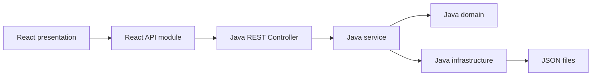

# Architecture

마지막 동기화: 2026-06-18

## 전체 구조

현재 시스템은 React 프론트엔드와 Java Spring Boot 백엔드로 분리한다.

## 프론트엔드

`frontend/src/features/<기능>`에는 `api`와 `presentation`만 둔다.

- `api`: Java REST API 호출
- `presentation`: React 화면과 사용자 입력

엔티티 검증, 중복 검사, 저장 처리는 프론트엔드에서 수행하지 않는다.

## 백엔드

`backend/src/main/java/com/oose/labsafety/<기능>`은 다음 계층을 사용한다.

- `domain`: Java record 엔티티와 입력 제약
- `service`: 등록·조회·삭제 유스케이스와 참조 무결성
- `infrastructure`: Jackson 기반 JSON Repository
- `presentation`: REST Controller

## 데이터 저장

배포되는 초기 데이터는 `backend/src/main/resources/data`에 둔다. 실행 시 수정되는 데이터는 `backend/data`에 분리한다.

이 방식은 시연용 데이터 규모에 적합하며, 향후 데이터베이스를 도입할 때 Java `infrastructure` 구현을 교체할 수 있다.
