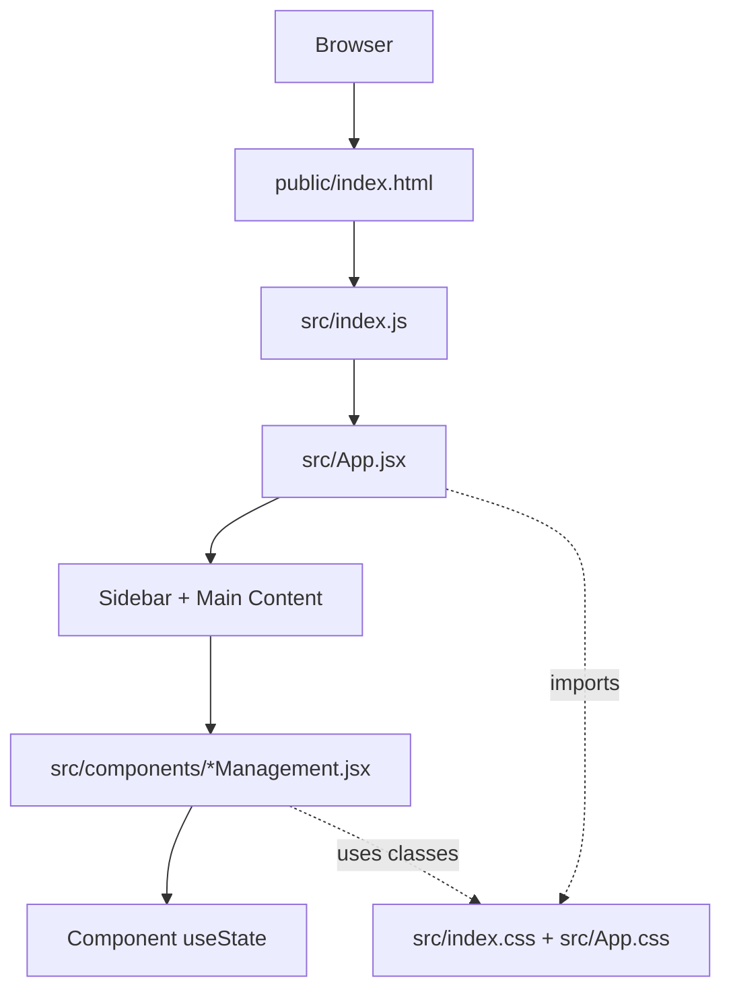
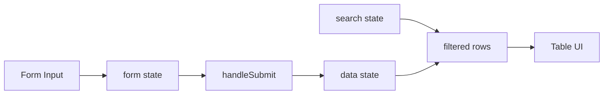

# Architecture.md

## 문서 동기화 정보

- 마지막 동기화 일자: 2026-06-11
- 현재 구현 기준: React 18, Create React App, 컴포넌트 단위 상태 관리
- 상위 참조 문서: `SRS_V1_0_0528.md`, `SDD_V1_0_0528.md`
- 관련 운영 문서: `../implementation-review.md`, `../run-guide.md`, `../documentation-maintenance.md`
- 메모: 이전 Java 21/MySQL 모듈형 모놀리식 기준 문서를 현재 React 프론트엔드 프로토타입 구조로 갱신했다.

## 개정 이력

| 버전 | 일자 | 변경 내용 |
| --- | --- | --- |
| v1.0.0 | 2026-05-28 | Java 21 기반 아키텍처 초안 작성 |
| v1.1.0 | 2026-05-29 | SRS/SDD 참조 및 구현 동기화 메모 반영 |
| v1.1.1 | 2026-05-29 | 존재 파일명 기준 SRS 링크 수정 및 공통 메뉴 반영 메모 추가 |
| v1.1.2 | 2026-05-29 | 공통 수정 흐름과 중복 등록 방지 메모 추가 |
| v2.0.0 | 2026-06-11 | 현재 React CRA 프로토타입 구조 기준으로 전면 갱신 |

## 1. 목적

이 문서는 현재 저장소에 구현된 연구실 안전관리 시스템의 실제 아키텍처를 설명한다. SRS/SDD의 업무 범위는 참조하되, 이 파일은 현재 코드 기준의 구조와 책임을 우선한다.

현재 구현은 백엔드, 데이터베이스, 라우터, 전역 상태 관리 없이 React 컴포넌트 내부 상태만으로 업무 화면을 시연하는 프론트엔드 프로토타입이다.

## 2. 구현 전제

- 런타임: Node.js 18 이상 권장
- UI 프레임워크: React 18
- 빌드 도구: Create React App (`react-scripts`)
- 진입 HTML: `public/index.html`
- 애플리케이션 진입점: `src/index.js`
- 최상위 컴포넌트: `src/App.jsx`
- 스타일: `src/index.css`, `src/App.css`
- 데이터 저장: 브라우저 런타임 메모리의 React `useState`
- 영속 저장소: 없음
- 서버 API: 없음
- 라우팅: 없음. 사이드바 메뉴 상태로 화면 전환

## 3. 전체 아키텍처 개요



핵심 흐름은 다음과 같다.

1. `public/index.html`의 `#root`에 React 앱이 마운트된다.
2. `src/index.js`가 `App`을 렌더링한다.
3. `src/App.jsx`가 사이드바 메뉴와 현재 활성 메뉴 상태를 관리한다.
4. `pageMap`이 활성 메뉴 ID를 업무 컴포넌트로 매핑한다.
5. 각 업무 컴포넌트가 자체 등록, 조회, 검색, 삭제 상태를 관리한다.
6. 공통 CSS 클래스가 모든 화면의 레이아웃과 UI 스타일을 제공한다.

## 4. 파일 구조

```text
public/
  index.html
src/
  index.js
  index.css
  App.jsx
  App.css
  components/
    UserManagement.jsx
    LaboratoryManagement.jsx
    ChemicalManagement.jsx
    WasteManagement.jsx
    ChecklistManagement.jsx
    InspectionManagement.jsx
    SafetyEducationManagement.jsx
docs/
  implementation-review.md
  run-guide.md
  agent-entry-documentation-policy.md
  documentation-maintenance.md
  reference_mdFileList/
    SRS_V1_0_0528.md
    SDD_V1_0_0528.md
    PMP_V1.0_0330.md
    architecture.md
```

## 5. 최상위 앱 구조

`src/App.jsx`는 현재 앱의 조립 지점이다.

- `menus`: 사이드바 메뉴 목록과 SDD 하위 시스템 식별자(`DSS-001` 등)를 정의한다.
- `pageMap`: 메뉴 ID와 실제 React 컴포넌트를 연결한다.
- `activeMenu`: 현재 선택된 메뉴 상태를 보관한다.
- `ActivePage`: 현재 메뉴에 대응하는 업무 화면 컴포넌트다.

현재 메뉴 구성은 다음과 같다.

| 메뉴 ID | 화면 | 컴포넌트 | SDD 식별자 |
| --- | --- | --- | --- |
| `user` | 사용자 관리 | `UserManagement` | DSS-001 |
| `lab` | 연구실 관리 | `LaboratoryManagement` | DSS-002 |
| `chemical` | 화학물질 관리 | `ChemicalManagement` | DSS-003 |
| `waste` | 폐기물 관리 | `WasteManagement` | DSS-004 |
| `checklist` | 일상점검 관리 | `ChecklistManagement` | DSS-005 |
| `inspection` | 점검 관리 | `InspectionManagement` | DSS-006 |
| `education` | 안전교육 관리 | `SafetyEducationManagement` | DSS-007 |

## 6. 컴포넌트 책임

각 관리 컴포넌트는 독립적인 화면 단위로 동작한다. 현재 공통 패턴은 다음과 같다.

- 등록 탭과 조회 탭을 내부 `tab` 상태로 전환한다.
- 폼 입력값을 `form` 상태로 관리한다.
- 등록된 행 목록을 `data` 상태로 관리한다.
- 검색 조건을 `search` 상태로 관리한다.
- 등록 성공 메시지를 `alert` 상태로 표시한다.
- 삭제 버튼으로 해당 행을 `data`에서 제거한다.

컴포넌트별 책임은 다음과 같다.

| 컴포넌트 | 책임 |
| --- | --- |
| `UserManagement.jsx` | 사용자 등록, 사용자 조회, 역할/부서 검색, 계정 상태 표시 |
| `LaboratoryManagement.jsx` | 연구실 등록, 건물/부서 검색, 관리등급과 사용 여부 표시 |
| `ChemicalManagement.jsx` | 화학물질 등록, 제조사/CAS 번호 검색, MSDS 존재 여부와 상태 표시 |
| `WasteManagement.jsx` | 폐기물 분류 등록, 유형 검색, 특성/처리 방법/법규 표시 |
| `ChecklistManagement.jsx` | 체크리스트 항목 등록, 점검 유형/필수 여부/사용 여부 표시 |
| `InspectionManagement.jsx` | 점검분야 분류 등록, 사용 여부 검색, 상세 설명 표시 |
| `SafetyEducationManagement.jsx` | 안전교육 관련 하위 화면 5개를 내부 섹션으로 제공 |

`SafetyEducationManagement.jsx`는 다음 하위 섹션을 포함한다.

- 연구활동종사자/이수기준
- 안전교육일지
- 수료증 발급
- 학습 결과
- 교육이수 결과

## 7. 상태와 데이터 흐름

현재 데이터 흐름은 컴포넌트 내부에서 닫혀 있다.



중요한 제약은 다음과 같다.

- 메뉴를 전환해도 해당 컴포넌트가 언마운트되면 내부 상태는 유지되지 않을 수 있다.
- 브라우저를 새로고침하면 모든 등록 데이터가 사라진다.
- 서로 다른 업무 화면 간 데이터 공유는 없다.
- 서버 검증, 중복 ID 검증, 감사 로그는 없다.

## 8. 스타일 구조

스타일은 전역 CSS 기반이다.

- `src/index.css`: 기본 박스 모델, body 폰트/배경, 입력/버튼 폰트 초기화
- `src/App.css`: 앱 레이아웃, 사이드바, 탭, 카드, 폼, 버튼, 검색바, 테이블, 배지, 알림 스타일

업무 컴포넌트는 별도 CSS 모듈을 갖지 않고 공통 클래스명을 사용한다. 따라서 UI 변경 시 `App.css`의 공통 클래스 영향 범위를 확인해야 한다.

## 9. 현재 아키텍처 한계

- 데이터 영속화가 없다.
- 백엔드 API와 데이터베이스가 없다.
- 인증, 권한, 사용자별 접근 제어가 없다.
- 삭제가 즉시 상태에서 제거되는 방식이며 이력 보존이 없다.
- 반복 CRUD 패턴이 각 컴포넌트에 중복되어 있다.
- `SafetyEducationManagement.jsx`는 여러 섹션을 한 파일에 담아 책임 범위가 크다.
- 테스트 스크립트와 자동화 테스트가 없다.
- SRS/SDD의 전체 설계와 현재 UI 필드 사이의 상세 추적성 문서가 아직 없다.

## 10. 확장 방향

현재 구조를 유지하면서 확장할 때는 다음 순서를 권장한다.

1. 대표 화면 1개에 React Testing Library 테스트를 추가한다.
2. 등록/조회/삭제/검색 패턴을 공통 훅으로 분리한다.
3. `SafetyEducationManagement.jsx`의 하위 섹션을 별도 파일로 분리한다.
4. 임시 영속화가 필요하면 `localStorage` 어댑터를 먼저 도입한다.
5. 실제 운영 전환 시 REST API와 서버 저장소를 연결한다.
6. 삭제 정책은 실제 삭제 대신 비활성화 또는 이력 보존 방식으로 바꾼다.

## 11. 참조 문서와의 관계

`SRS_V1_0_0528.md`와 `SDD_V1_0_0528.md`는 업무 요구사항과 상세 설계 기준이다. 현재 React 구현은 이 문서의 전체 계층 구조를 그대로 구현하지 않고, 화면 시연이 가능한 프론트엔드 프로토타입으로 축소되어 있다.

따라서 향후 작업자는 다음을 구분해야 한다.

- 현재 구현 사실: `src/`와 `docs/implementation-review.md`
- 실행 방법: `docs/run-guide.md`
- 문서 관리 규칙: `docs/documentation-maintenance.md`
- 원본 요구사항/설계 기준: `docs/reference_mdFileList/SRS_V1_0_0528.md`, `docs/reference_mdFileList/SDD_V1_0_0528.md`

## 12. 테스트 전략

현재 테스트는 구현되어 있지 않다. 우선순위가 높은 테스트는 다음과 같다.

- 메뉴 전환 테스트: 사이드바 메뉴 클릭 시 대응 화면 제목이 표시되는지 확인한다.
- CRUD 플로우 테스트: 대표 화면에서 필수값 입력, 등록, 조회 탭 전환, 검색, 삭제가 동작하는지 확인한다.

테스트 스크립트가 추가되면 `docs/run-guide.md`와 이 문서를 함께 갱신한다.

## 13. 변경 기준

다음 변경이 발생하면 이 문서를 갱신한다.

- `src/App.jsx`의 메뉴 구조 또는 화면 매핑 변경
- `src/components/`의 컴포넌트 추가, 삭제, 분리
- 상태 관리 방식 변경
- 저장소/API 연동 추가
- 라우터 도입
- 테스트/빌드 구조 변경

문서가 더 길어지면 세부 주제는 `docs/documentation-maintenance.md` 기준에 따라 별도 문서로 분리하고, 이 문서에는 아키텍처 관점의 요약과 링크만 남긴다.
