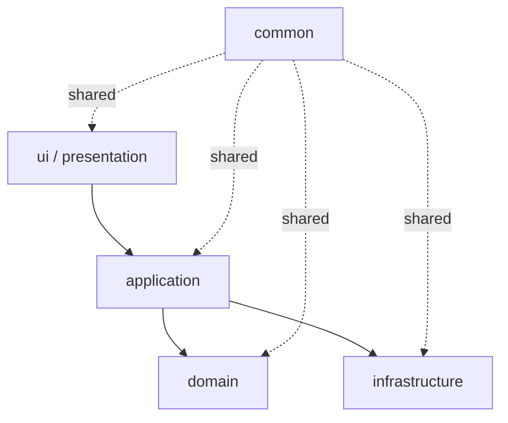

# Core Architecture

## 문서 동기화 정보

- 마지막 동기화 일자: 2026-05-29
- 기준: SDD v1.0.0 (`reference_mdFileList/SDD_V1_0_0528.md`)
- 메모: 현재 구현은 `Boundary -> presentation`, `Control -> application`, `Entity -> domain`, `DB access -> infrastructure` 매핑을 따른다.

## 개정 이력

| 버전   | 일자       | 변경 내용                         |
| ------ | ---------- | --------------------------------- |
| v1.0.0 | 2026-05-29 | 계층/패턴/확장 규칙 문서화        |
| v1.1.0 | 2026-05-29 | SDD 기준 매핑 및 동기화 정보 추가 |

## 1. 계층

시스템은 다음 순서로 흐른다.

## 2. 공통 규칙

- UI는 입력만 받고 결과만 보여준다.
- Application은 메뉴 선택을 실제 작업으로 변환한다.
- Domain은 데이터와 규칙을 함께 가진다.
- Infrastructure는 저장소 구현을 담당한다.
- Common은 반복되는 기술 규약을 모은다.

## 3. 구현 패턴

- `FeatureModule`은 메뉴의 공통 계약이다.
- `AbstractCatalogModule`은 반복되는 메뉴 처리를 담당한다.
- `AbstractCatalogService`는 메모리 저장소 기반 CRUD를 감싼다.
- 각 기능은 이 공통 골격 위에 도메인 입력만 덧붙인다.

## 4. 확장 규칙

새 기능을 추가할 때는 다음 순서로 만든다.

1. `domain` record 또는 class
2. `infrastructure` 저장소
3. `application` 서비스
4. `presentation` 메뉴
5. `ApplicationBootstrap` 등록
