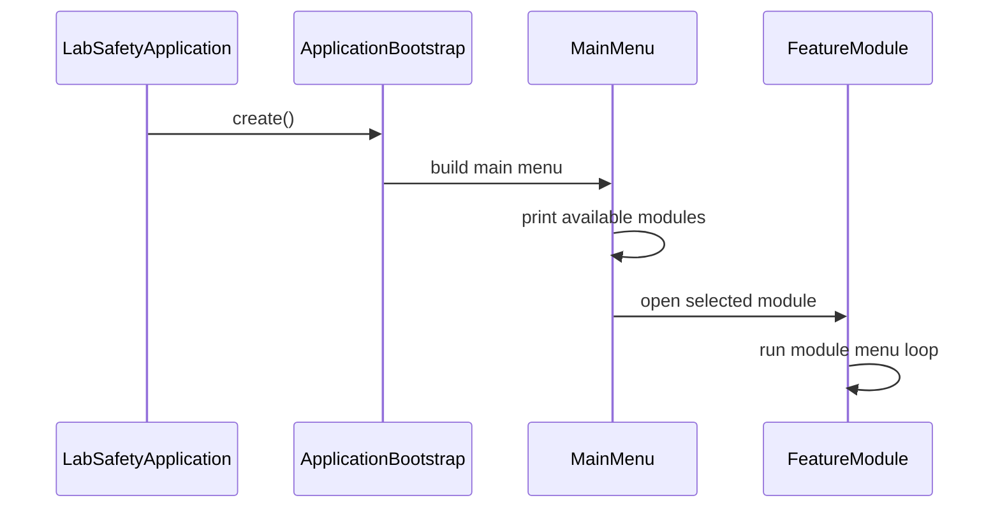

# Operation Flow

## 문서 동기화 정보

- 마지막 동기화 일자: 2026-05-29
- 기준 문서: `../../reference_mdFileList/SRS_V1_0_0528.md`, `../../reference_mdFileList/SDD_V1_0_0528.md`
- 변경 사항: 모듈 신규 등록 단계의 입력 항목과 공통 조회/수정/삭제 흐름은 SRS/SDD 기준으로 업데이트되었다.

## 개정 이력

| 버전   | 일자       | 변경 내용                      |
| ------ | ---------- | ------------------------------ |
| v1.0.0 | 2026-05-29 | 구동/메뉴 동작 플로우 문서화   |
| v1.1.0 | 2026-05-29 | SDD 기반 입력 변경 사항 동기화 |
| v1.2.0 | 2026-05-29 | 검색, 상세 조회, 식별자 삭제 흐름 추가 |
| v1.3.0 | 2026-05-29 | 식별자 수정 및 중복 등록 방지 흐름 추가 |

## 1. 시작 흐름

## 2. 동작 방식

1. `LabSafetyApplication`이 시작된다.
2. `ApplicationBootstrap`이 콘솔과 모듈 목록을 만든다.
3. `MainMenu`가 모듈 목록을 사용자에게 보여준다.
4. 사용자가 모듈을 선택하면 해당 모듈 메뉴로 이동한다.
5. 모듈 메뉴는 개요, 목록 조회, 키워드 검색, 상세 조회, 신규 등록, 식별자 수정, 데모 데이터 적재, 식별자 삭제, 전체 삭제를 처리한다.
6. 뒤로가기를 선택하면 메인 메뉴로 돌아온다.

## 3. 유지보수 포인트

- 메뉴 문구를 바꾸려면 `ui/MainMenu`를 수정한다.
- 모듈별 입력 항목을 바꾸려면 해당 모듈의 `presentation`을 수정한다.
- 요약 표시 문자열은 도메인 record의 `summary()`를 수정한다.
- 저장 정책을 바꾸려면 `infrastructure`를 교체한다.
- 공통 메뉴 항목을 바꾸려면 `common/AbstractCatalogModule`과 `docs/traceability-map.md`를 함께 수정한다.
