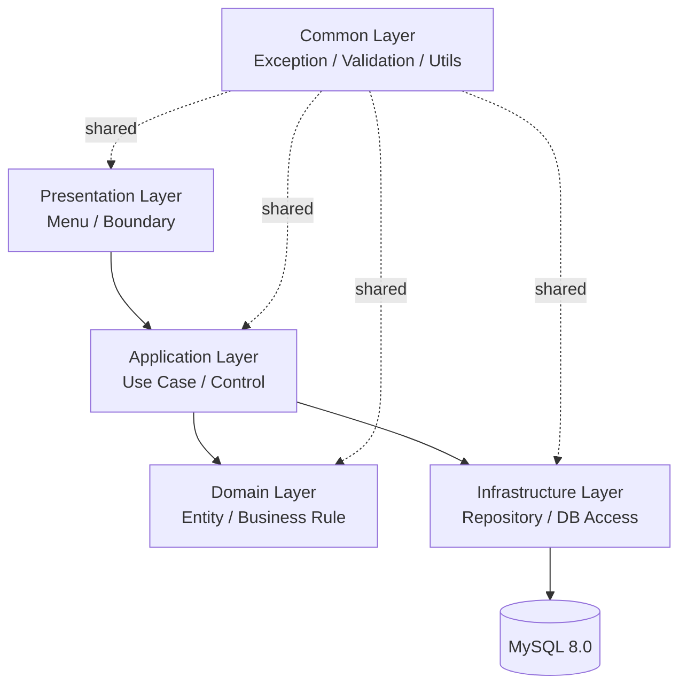

# Architecture.md

## 1. 목적

이 문서는 `reference_mdFileList` 아래의 요구사항/설계 문서를 바탕으로, 연구실 안전관리 시스템을 Java 21로 구현하기 위한 전체 구조를 정의한다.

구현 목표는 다음과 같다.

- 문서 기반 요구사항을 기능 단위로 일관되게 구현할 수 있는 구조를 제공한다.
- 사용자 관리, 연구실 관리, 화학물질 관리, 폐기물 관리, 점검 관리, 안전교육 관리를 독립적인 모듈로 분리한다.
- 초기 구현부터 유지보수 가능한 계층형 구조를 유지한다.

## 2. 구현 전제

- 개발 언어: Java 21
- 운영 데이터 저장소: MySQL 8.0
- 인코딩: UTF-8
- 구현 방식: 모듈형 모놀리식 구조
- 설계 기준: SRS의 기능 요구사항과 SDD의 Boundary / Control / Entity 분해를 우선 반영

Java 21 기준으로 `record`, `switch` 표현식, `java.time` 패키지, 필요 시 `sealed` 타입을 적극 활용한다. 다만 첫 버전에서는 가독성과 유지보수를 우선하여 과도한 문법 최적화는 피한다.

## 3. 전체 아키텍처 개요

시스템은 하나의 JVM 애플리케이션 안에서 동작하되, 역할별로 명확히 분리된 계층을 가진다.



핵심 원칙은 다음과 같다.

- UI는 입력과 출력만 담당한다.
- Application 계층이 유스케이스를 조합하고 트랜잭션 경계를 가진다.
- Domain 계층은 비즈니스 규칙과 상태를 보관한다.
- Infrastructure 계층은 MySQL 접근만 담당한다.
- 공통 기능은 별도 패키지로 분리하여 중복을 줄인다.

## 4. 계층별 책임

### 4.1 Presentation Layer

화면, 메뉴, 입력 검증 전 단계의 사용자 인터페이스를 담당한다.

- 메인 메뉴 출력
- 사용자 입력 수집
- 결과 메시지 표시
- 각 기능별 화면 전환

SDD의 `MainUI`와 각 `Boundary` 클래스는 이 계층에 대응한다.

### 4.2 Application Layer

하나의 기능 요청을 실제 작업 흐름으로 조립하는 계층이다.

- 사용자 등록, 조회, 수정, 삭제 같은 유스케이스 실행
- 여러 도메인 객체 협업 조정
- 트랜잭션 처리
- 예외를 사용자 메시지로 변환하기 위한 상위 제어

SDD의 `Control` 클래스는 이 계층에 대응한다.

### 4.3 Domain Layer

시스템의 핵심 규칙과 상태를 담는 계층이다.

- 사용자, 연구실, 화학물질, 폐기물, 점검, 안전교육 엔티티 정의
- 상태 전이와 필수값 규칙 처리
- 도메인 고유 검증 규칙 보유

SDD의 `Entity` 클래스는 이 계층에 대응한다.

### 4.4 Infrastructure Layer

외부 시스템과의 연결을 담당한다.

- MySQL CRUD 처리
- SQL 매핑
- 저장소 구현체
- 파일, 로그, 외부 연계가 필요할 경우의 어댑터

### 4.5 Common Layer

모든 모듈에서 재사용하는 요소를 둔다.

- 공통 예외
- 검증 유틸리티
- 상수와 코드값
- 시간 처리, 문자열 처리, 포맷터

## 5. 기능 모듈 분리

기능은 문서의 SRS/SDD 기준에 맞춰 다음 모듈로 나눈다.

1. 사용자 관리
2. 연구실 관리
3. 화학물질 관리
4. 폐기물 관리
5. 점검 관리
6. 안전교육 관리

각 모듈은 아래 구조를 기본으로 가진다.

- `presentation`: 화면 및 메뉴
- `application`: 유스케이스 서비스
- `domain`: 엔티티와 규칙
- `infrastructure`: 저장소와 DB 접근

공통 조회나 통계가 필요하면 별도의 `report` 또는 `statistics` 하위 모듈을 두되, 우선 구현에서는 기존 기능 모듈이 제공하는 조회 결과를 조합하는 방식으로 시작한다.

## 6. 권장 패키지 구조

```text
src/main/java/com/oose/labsafety/
  common/
    exception/
    validation/
    util/
    constants/
  user/
    presentation/
    application/
    domain/
    infrastructure/
  laboratory/
    presentation/
    application/
    domain/
    infrastructure/
  chemical/
    presentation/
    application/
    domain/
    infrastructure/
  waste/
    presentation/
    application/
    domain/
    infrastructure/
  inspection/
    presentation/
    application/
    domain/
    infrastructure/
  education/
    presentation/
    application/
    domain/
    infrastructure/
  report/
    application/
    presentation/
```

권장 네이밍 규칙은 다음과 같다.

- 화면 클래스: `*Menu`, `*View`, `*Screen`
- 서비스 클래스: `*Service`, `*UseCase`
- 저장소 클래스: `*Repository`, `*Dao`
- 도메인 클래스: 단수형 명사
- 요청/응답 모델: `*Request`, `*Response`, `*Dto`

## 7. 데이터와 저장소 전략

데이터베이스는 MySQL 8.0을 사용한다.

- 테이블은 SDD의 Entity 명세를 기준으로 만든다.
- 기본 키는 문서에 정의된 업무 식별자를 우선 사용한다.
- 조회 성능이 중요한 필드는 인덱스를 별도 검토한다.
- 날짜/시간은 `java.time.LocalDate`, `LocalDateTime`, `Instant`를 우선 사용한다.
- DB 접근은 직접 SQL을 쓰더라도 저장소 계층으로 격리한다.

엔티티와 테이블의 매핑은 다음 원칙을 따른다.

- 한 엔티티는 한 책임만 갖는다.
- 관계가 복잡한 경우 조인 테이블 또는 별도 참조 엔티티를 둔다.
- 상태값은 문자열 남발을 피하고 enum 또는 코드값으로 제한한다.

## 8. 유스케이스 처리 흐름

모든 기능은 같은 흐름으로 처리한다.

1. Presentation이 사용자 입력을 받는다.
2. Application이 입력값을 검증하고 유스케이스를 시작한다.
3. Domain 객체를 생성하거나 갱신한다.
4. Infrastructure가 저장 또는 조회를 수행한다.
5. 결과를 Application이 정리한다.
6. Presentation이 사용자에게 결과를 보여준다.

이 방식으로 사용자 등록, 연구실 등록, 화학물질 입출고, 폐기물 기록, 점검 등록, 교육 이수 등록 등 모든 기능을 동일한 구조로 구현한다.

## 9. 검증과 예외 처리

검증은 두 단계로 나눈다.

- 1차 검증: 화면 입력 단계에서 필수값, 형식, 길이 확인
- 2차 검증: Application과 Domain에서 업무 규칙 확인

예외 처리 원칙은 다음과 같다.

- 사용자 오류와 시스템 오류를 구분한다.
- 예외 메시지는 사용자 친화적으로 변환한다.
- 저장소 오류는 상위 계층에 직접 노출하지 않는다.
- 모든 예외는 공통 예외 계층에서 표준화한다.

## 10. 구현 순서

첫 구현은 공통 기반부터 시작한다.

1. 공통 예외, 검증, 유틸리티
2. 사용자 관리
3. 연구실 관리
4. 화학물질 관리
5. 폐기물 관리
6. 점검 관리
7. 안전교육 관리
8. 통합 조회와 화면 정리
9. 테스트 보강과 리팩터링

이 순서로 진행하면 공통 규칙을 먼저 고정하고, 이후 모듈을 반복 가능한 방식으로 확장할 수 있다.

## 11. 테스트 전략

기능 구현과 동시에 테스트를 둔다.

- Domain 테스트: 상태 규칙과 입력 검증
- Service 테스트: 유스케이스 흐름과 예외
- Repository 테스트: DB 저장과 조회
- 통합 테스트: 주요 화면 또는 기능 플로우

가능하면 JDK 21 기준으로 테스트를 실행하고, 실제 MySQL과의 적합성은 별도 통합 테스트로 확인한다.

## 12. 변경 기준

이 문서는 초기 구현 기준서이다.

- SRS가 갱신되면 기능 모듈 분리를 먼저 검토한다.
- SDD의 Entity 또는 Table 명세가 바뀌면 Domain과 Repository를 함께 갱신한다.
- 화면 구조가 변경되어도 Application과 Domain은 최대한 유지한다.

## 13. 결론

본 시스템은 Java 21 기반의 모듈형 모놀리식 구조로 구현한다. 기능별 모듈을 독립적으로 유지하면서도, 공통 계층과 데이터 접근 계층을 표준화하여 연구실 안전관리 업무를 안정적으로 구현하는 것을 목표로 한다.
